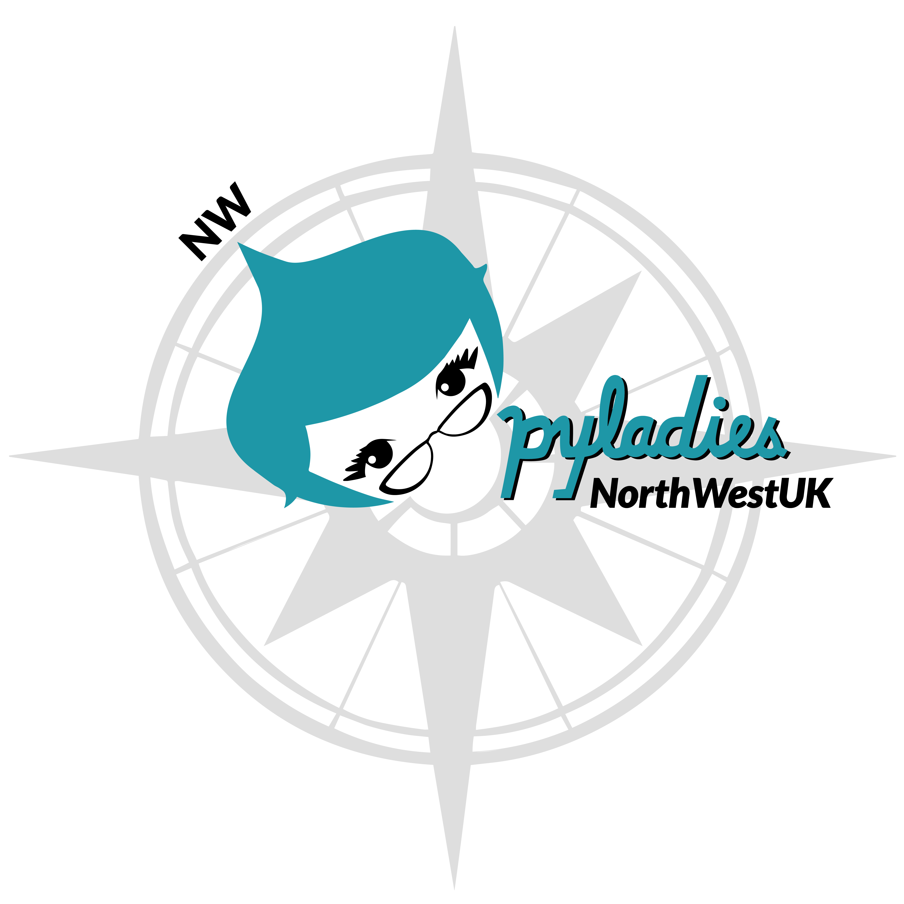

# digital_assets

Digital assets collection for the PyLadies NorthWest UK chapter

## Logo
The logo comes in 4 variations:
* pylady, compass and writing - complex, square
* pylady, writing
* pylady, writing - square
* writing

## Colour schemes
Each variation comes in 4 colours:

## Fonts used
NorthWestUK font: "Lato"

---
 This work is licensed under a <a rel="license" href="http://creativecommons.org/licenses/by/4.0/">Creative Commons Attribution 4.0 International License</a>.
